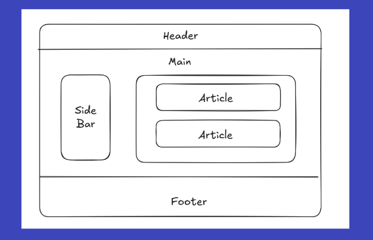
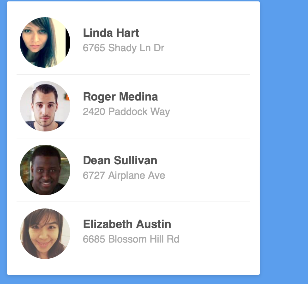
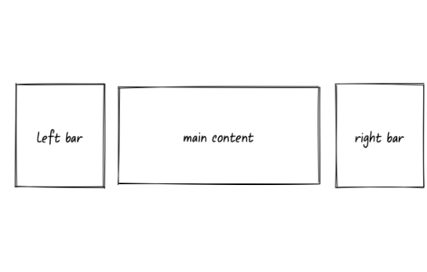

# Exercícios de Desenvolvimento Web 

    Exercícios desenvolvidos na matéria de Prgramação Web do curso de Bacharelado em Ciência da Computação.

### Questão 1: Estruturação Semântica e Estilização com Display Inline

- Crie uma página simples que contenha um cabeçalho (header), uma seção principal (main) e um rodapé (footer). Dentro da seção principal, adicione três parágrafos com algum texto de exemplo.
- Utilize as tags semânticas <header>, <main>, e <footer> para estruturar a página.
- No CSS, estilize os parágrafos dentro da seção principal para que eles sejam exibidos na mesma linha, utilizando a propriedade display: inline.
- Aplique uma cor de fundo, uma cor de texto, e adicione uma borda arredondada nos parágrafos.
- Defina uma margem de 10 pixels e um padding de 5 pixels entre os parágrafos.
- Estilize o cabeçalho e o rodapé para que tenham um fundo diferente do restante da página, centralize o texto e adicione espaçamento interno (padding).

### Questão 2: Blocos em Linha e Unidades de Medida Relativas

- Crie uma página que contenha uma navegação (nav) com três links. Abaixo da navegação, adicione uma seção com duas caixas de texto lado a lado.
- Utilize a tag <nav> para a navegação e a tag <section> para a seção das caixas de texto.
- No CSS, estilize os links dentro da navegação para que fiquem em linha, utilizando display: inline-block, e defina uma largura de 20% da tela (vw) para cada link.
- Aplique uma cor de fundo, uma cor de texto, e adicione uma borda arredondada nos links.
- Estilize as duas caixas de texto na seção para que tenham display: inline-block, largura de 45%, e margem de 5% entre elas.
- Adicione uma cor de fundo, cor de texto, uma borda sólida, e sombra às caixas de texto.

### Questão 3

Seguindo esse padrão da primeira aula de css, tente estilizar o máximo esse site pessoal seu, imagine que está produzindo um blog. Utilize também o display flex para dimensionar os elementos.

### Questão 4 

Adicione um fundo azul, com um card branco simulando perfis de usuários. Use o display flex e as propriedades vistas na sala, não necessariamente precisa ficar igual a imagem mas deixar de uma forma semelhante.

### Questão 5

Quando seria mais adequado utilizar CSS Grid em vez de display flex? Dê exemplos de layouts onde o Grid seria a melhor escolha.

Após sua pesquisa tente replicar esse layout abaixo utilizando grid

